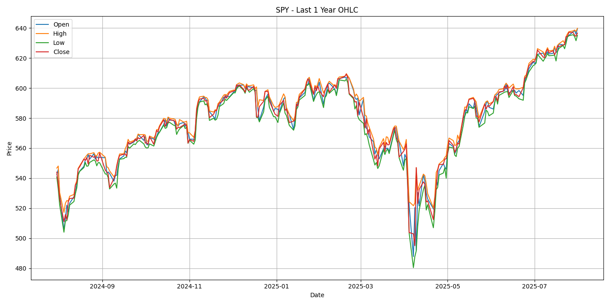

# 📊 Project101 — SPY OHLC Visualization

This project demonstrates how to fetch and visualize 1-year OHLC (Open, High, Low, Close) data for the SPY ETF using Python, `yfinance`, and `matplotlib`. It follows a modular and professional structure suitable for quant research workflows, version-controlled via Git.

---

## 📁 Project Structure

```
Project101/
├── data/                  # Stores downloaded SPY OHLC data (CSV)
├── notebooks/             # Saved chart images and optional Jupyter notebooks
│   └── spy_ohlc_plot.png  # SPY chart output
├── src/                   # Python scripts (core logic)
│   └── fetch_and_plot.py  # Script to fetch data and generate plot
├── venv/                  # Virtual environment (excluded from GitHub)
├── requirements.txt       # Project dependencies
└── README.md              # You're reading it :)
```

---

## 📈 Features

- Downloads 1-year OHLC data for SPY using `yfinance`
- Saves data to `data/spy_1y.csv`
- Plots time-series chart to `notebooks/spy_ohlc_plot.png`
- Clean, modular, production-ready Python code
- Git versioning with minimum 3 commits

---

## ▶️ Quick Start

### 1. Clone the Repository

```bash
git clone https://github.com/009VIR/Project101.git
cd Project101
```

### 2. Create and Activate Virtual Environment

```bash
python -m venv venv
venv\Scripts\activate    # On Windows
# source venv/bin/activate  # On Mac/Linux
```

### 3. Install Dependencies

```bash
pip install -r requirements.txt
```

### 4. Run the Script

```bash
python src/fetch_and_plot.py
```

---

## 🧪 Output

- 📄 `data/spy_1y.csv` → Cleaned OHLC data
- 🖼️ `notebooks/spy_ohlc_plot.png` → SPY OHLC time-series plot

---

## 🗂️ Git Commit Log

Ensure your Git history includes at least 3 commits:

```bash
git log --oneline
```

---

## 🔧 Tech Stack

- Python 3.10+
- yfinance
- matplotlib
- Git for version control

---

## 🧠 Learning Goals

- Learn how to extract and clean financial data
- Practice with time-series charting and visualization
- Follow industry-style project structure and reproducibility
- Use Git to maintain a professional development workflow

---

## ✅ Screenshot

Below is the final SPY OHLC chart generated by the script:



---

## 📬 Contact

**Author**: 009VIR  
**GitHub**: [https://github.com/009VIR/Project101](https://github.com/009VIR/Project101)

---

